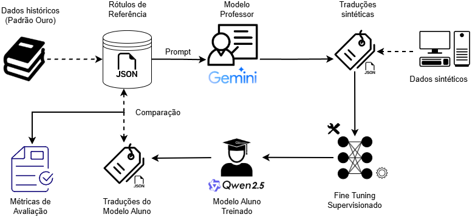

# Tradução Tupi-Português via *small language model*

Projeto de Mestrado (PUC) sobre a destilação de conhecimento de LLMs aplicada à tradução automática para línguas de baixo recurso (*Low-Resource Languages*, LRLs), com foco no par **Tupi Antigo → Português brasileiro**.
O trabalho tem como base o artigo *"Are Small Language Models the Silver Bullet
to Low-Resource Languages Machine Translation?"* (LoResMT 2026) expandido para o Tupi, avaliando o
*fine-tuning* supervisionado (SFT) com **LoRA/PEFT** sobre o modelo **Qwen2.5-3B-Instruct**.

<div style="text-align: center;">
  
</div>

---

## Sumário

- [Visão geral](#visão-geral)
- [Estrutura do repositório](#estrutura-do-repositório)
- [Dados](#dados)
- [Como treinar (SFT)](#como-treinar-sft)
- [Inferência](#inferência)
- [Resultados](#resultados)

---

## Visão geral

Línguas de baixo recurso apresentam desafios importantes para o Processamento de
Linguagem Natural (PLN) devido à escassez de dados paralelos. Este projeto investiga
se um *Small Language Model* (SLM) de 3B parâmetros, ajustado com *fine-tuning*
paramétrico-eficiente (LoRA), consegue traduzir sentenças do **Tupi Antigo** para o
**Português brasileiro** a partir de um conjunto de dados aumentado
(`dataset_augmentated`).

Componentes principais:

- **SFT (treinamento):** `script/SFT.py`.
- **Avaliação/Inferência:** `script/EVAL_SFT.py`.
- **Utilidades:** `utils/` — pré-processamento e construção de *prompts*.

## Estrutura do repositório

```
slm_tupi/
├── README.md                  # este arquivo
├── requirements.txt           # dependências Python
├── .gitignore
│
├── notebooks/                 # notebooks do projeto
│   ├── sft.ipynb              # notebook do fine-tuning (SFT)
│   └── eval_sft.ipynb         # avaliação do modelo ajustado
│
├── script/                    # código-fonte organizado
│   ├── SFT.py                 # versão em script do treinamento SFT
│   └── EVAL_SFT.py            # versão em script da avaliação do modelo
│
├── utils/
│   ├── __init__.py
│   ├── utils_train.py         # pre_process e create_prompt
│   └── utils_nlp.py
│
├── data/                      # datasets
├── models/                    # modelo após SFT/adapters LoRA
├── docs/
│   └── report/
│       └── Relatorio_Final.md # relatório com resumo do projeto
└── assets/                    # figuras e exemplos
```

## Dados

O conjunto de treino é um JSON com pares Tupi/Português nas colunas
`input` (Tupi) e `output` (Português).

Exemplo de registro:

```json
{ "input": "kunhãmukuetá îkó ka'ape", "output": "moças vivem na mata" }
```

## Como treinar (SFT)

O fluxo principal está em `script/SFT.py`. Parâmetros usados no experimento
de referência:

| Parâmetro | Valor |
|---|---|
| Modelo base | `Qwen/Qwen2.5-3B-Instruct` |
| Método | LoRA (PEFT), `r = 256`, `lora_alpha = 8` |
| Módulos-alvo | `q,k,v,o_proj`, `gate,up,down_proj` |
| Épocas | 3 |
| Learning rate | 1e-5, *scheduler* cosseno, `warmup_ratio = 0.5` |
| Batch (train/eval) | 1 / 1 |
| `max_seq_length` | 128 |
| Precisão | fp32 |

Via script:

```bash
python script/SFT.py \
  --model_path "Qwen/Qwen2.5-3B-Instruct" \
  --training_dataset_path "data/dataset_augmentated.json" \
  --src_lng "Tupi" --tgt_lng "Português" \
  --is_peft True --r 256 --num_train_epochs 3 --learning_rate 1e-5
```

Os *logs* de treino (TensorBoard) e os *checkpoints* dos adaptadores LoRA serão gravados
em `logs/` / `models/` ao executar o script.

## Inferência

`script/EVAL_SFT.py` carrega o modelo base + adaptador LoRA e gera traduções do
conjunto de validação, salvando `predictions.csv`.

## Resultados

O experimento de referência (adaptador `peft_128_Tu_Po`, *checkpoint* final) atingiu
`train_loss ≈ 1.27`, com `eval` a cada 1000 passos ao longo de 3 épocas. Consulte o
[relatório final](docs/report/Relatorio_Final.md) para a análise completa da curva de
perda, tempo de treino (~18 h) (análises dos resultados em produção).
