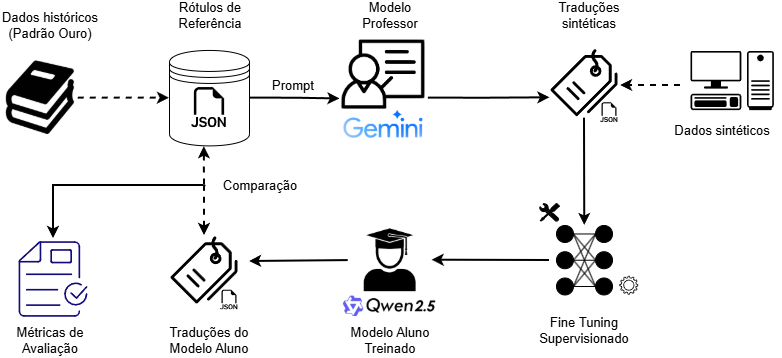

# Tradução Tupi-Português via *small language model*

Projeto de Mestrado (PUC) sobre a destilação de conhecimento de LLMs aplicada à tradução automática para línguas de baixo recurso (*Low-Resource Languages*, LRLs), com foco no par **Tupi Antigo → Português brasileiro**.
O trabalho tem como base o artigo *"Are Small Language Models the Silver Bullet
to Low-Resource Languages Machine Translation?"* (LoResMT 2026) expandido para o Tupi, avaliando o
*fine-tuning* supervisionado (SFT) com **LoRA/PEFT** sobre o modelo **Qwen2.5-3B-Instruct**.

<div style="text-align: center;">
  
</div>

---

## Sumário

- [Visão geral](#visão-geral)
- [Estrutura do repositório](#estrutura-do-repositório)
- [Dados](#dados)
- [Como treinar (SFT)](#como-treinar-sft)
- [Inferência](#inferência)
- [Resultados](#resultados)
  - [Treinamento e custo computacional](#treinamento-e-custo-computacional)
  - [Protocolo de avaliação](#protocolo-de-avaliação)
  - [Antes e depois do ajuste fino](#antes-e-depois-do-ajuste-fino)
  - [Comparação com o modelo-professor](#comparação-com-o-modelo-professor)
  - [Análise qualitativa](#análise-qualitativa)
  - [Limitações e próximos passos](#limitações-e-próximos-passos)

---

## Visão geral

Línguas de baixo recurso apresentam desafios importantes para o Processamento de
Linguagem Natural (PLN) devido à escassez de dados paralelos. Este projeto investiga
se um *Small Language Model* (SLM) de 3B parâmetros, ajustado com *fine-tuning*
paramétrico-eficiente (LoRA), consegue traduzir sentenças do **Tupi Antigo** para o
**Português brasileiro** a partir de um conjunto de dados aumentado
(`dataset_augmentated`).

Componentes principais:

- **SFT (treinamento):** `script/SFT.py`.
- **Avaliação/Inferência:** `script/EVAL_SFT.py`.
- **Utilidades:** `utils/` — pré-processamento e construção de *prompts*.

Principais resultados (detalhes em [Resultados](#resultados)):

- **O ajuste fino funciona.** O ChrF++ médio do aluno sobe de 12,5 para 28,8 (+131%) e o TER médio cai de 435,9% para 118,6% (−72,8%), com ganhos estatisticamente significativos nas cinco métricas. As respostas deixam de ser verborrágicas e passam a seguir o formato da tarefa.
- **O ganho se concentra nas estruturas sintéticas.** O ChrF++ médio é 56,6 nas sentenças com estrutura de *template* e 23,5 nas históricas; nas sentenças históricas comuns à avaliação do professor (Gemini), o aluno recupera pouco menos de um terço do ChrF++ dele (12,6 contra 41,2).
- **O custo é baixo.** Cerca de 18 h 24 min de treino em uma GPU doméstica (RTX 2060, 6 GB), ajustando ≈ 7,2% dos parâmetros do modelo.

## Estrutura do repositório

```
slm_tupi/
├── README.md                  # este arquivo
├── requirements.txt           # dependências Python
├── .gitignore
│
├── notebooks/                 # notebooks do projeto
│   ├── sft.ipynb              # notebook do fine-tuning (SFT)
│   └── eval_sft.ipynb         # avaliação do modelo ajustado
│
├── script/                    # código-fonte organizado
│   ├── SFT.py                 # versão em script do treinamento SFT
│   └── EVAL_SFT.py            # versão em script da avaliação do modelo
│
├── utils/
│   ├── __init__.py
│   ├── utils_train.py         # pre_process e create_prompt
│   └── utils_nlp.py
│
├── data/                      # datasets
├── docs/
│   └── report/
│       └── Relatorio_Final.md # relatório com resumo do projeto
└── assets/                    # figuras e exemplos
```

## Dados

O conjunto de treino é um JSON com pares Tupi/Português nas colunas
`input` (Tupi) e `output` (Português).

Exemplo de registro:

```json
{ "input": "kunhãmukuetá îkó ka'ape", "output": "moças vivem na mata" }
```

O `dataset_augmentated` combina dois subconjuntos complementares, num total de cerca de 2 mil pares:

- **Histórico (802 pares, ≈ 40%).** Frases extraídas de textos, cartas e obras de referência do Tupi Antigo, majoritariamente traduzidos por Eduardo Navarro (por exemplo, *A vida em Caraguatatuba* e as *Cartas dos Índios Camarões*), com a grafia padronizada segundo o dicionário de Navarro. Na avaliação, a referência é a tradução humana (*gold standard*); no treino, o alvo é a tradução gerada pelo modelo-professor (Gemini, *zero-shot*), que é o rótulo da destilação.
- **Sintético (≈ 1,2 mil pares, ≈ 60%).** Frases geradas pela combinação de um léxico com *templates* gramaticais inspirados no *Método moderno de tupi antigo*, com no máximo 100 frases por *template*. O alvo (e a referência) é a tradução do próprio *template* (*standard label*).

Os pares são embaralhados (semente 42) e divididos em 70% para treino e 30% para validação (≈ 1,4 mil e ≈ 0,6 mil sentenças). A partição de 30% nunca participa da otimização e serve de conjunto de teste na avaliação.

## Como treinar (SFT)

O fluxo principal está em `script/SFT.py`. Parâmetros usados no experimento
de referência:

| Parâmetro | Valor |
|---|---|
| Modelo base | `Qwen/Qwen2.5-3B-Instruct` |
| Método | LoRA (PEFT), `r = 256`, `lora_alpha = 8` |
| Módulos-alvo | `q,k,v,o_proj`, `gate,up,down_proj` |
| Épocas | 3 |
| Learning rate | 1e-5, *scheduler* cosseno, `warmup_ratio = 0.5` |
| Batch (train/eval) | 1 / 1 |
| `max_seq_length` | 128 |
| Precisão | fp32 |

Via script:

```bash
python script/SFT.py \
  --model_path "Qwen/Qwen2.5-3B-Instruct" \
  --training_dataset_path "data/dataset_augmentated.json" \
  --src_lng "Tupi" --tgt_lng "Português" \
  --is_peft True --r 256 --num_train_epochs 3 --learning_rate 1e-5
```

Os *logs* de treino (TensorBoard) e os *checkpoints* dos adaptadores LoRA serão gravados
em `logs/` / `models/` ao executar o script.

## Inferência

`script/EVAL_SFT.py` carrega o modelo base + adaptador LoRA e gera traduções do
conjunto de validação, salvando `predictions.csv`.

## Resultados

O experimento de referência (adaptador `peft_128_Tu_Po`, *checkpoint* final) atingiu
`train_loss ≈ 1.27`, com `eval` a cada 1000 passos ao longo de 3 épocas. Consulte o
[relatório final](docs/report/Relatorio_Final.md) para a análise completa da curva de
perda, tempo de treino (~18 h) e demais métricas. O resumo abaixo reúne os números da
avaliação desse experimento.

### Treinamento e custo computacional

A perda de treino cai de ≈ 2,71 (passo 1000) para ≈ 0,66 (passo 4000), com média de 1,27 ao longo das 3 épocas e sem sinais de divergência. O gargalo foi a memória: um modelo de 3 B em fp32, sem quantização, chegou a um pico de ≈ 17,7 GB reservados contra 6 GB de VRAM, o que forçou o uso de memória compartilhada do sistema e explica o tempo de treino elevado.

| Item | Valor |
|---|---|
| Tempo total de treino | ≈ 18 h 24 min (66.255 s; ≈ 0,064 passos/s) |
| GPU | NVIDIA GeForce RTX 2060, 6 GB de VRAM |
| Pico de memória reservada | ≈ 17,7 GB |
| Parâmetros treináveis (LoRA) | ≈ 239,5 M (7,2% dos 3,33 B do modelo) |

### Protocolo de avaliação

- **Teste:** as 601 sentenças da partição de 30% separada antes do treino (históricas e sintéticas). A linha de base é o próprio Qwen2.5-3B-Instruct sem ajuste (*zero-shot*), que recebe a mesma instrução de tradução.
- **Referências:** tradução humana nas sentenças históricas e rótulo do *template* nas sintéticas.
- **Métricas:** BLEU, ChrF++, TER, ROUGE-L e Jaccard, calculadas sobre predições e referências normalizadas (caixa baixa, sem pontuação nem caracteres especiais). BLEU, ROUGE-L e Jaccard estão na escala 0–1; ChrF++ e TER, em pontos percentuais. O TER mede esforço de edição (**menor é melhor**) e pode passar de 100% quando a predição é bem mais longa que a referência.
- **Significância:** teste de postos sinalizados de Wilcoxon sobre as diferenças pareadas por sentença.
- **Geração:** as predições do modelo ajustado vêm de `script/EVAL_SFT.py` (modelo base + adaptador LoRA em 4-bit NF4, `temperature = 0.1`, `top_p = 0.9`, `max_new_tokens = 50`, amostragem ativada) e são salvas em `predictions.csv`.

### Antes e depois do ajuste fino

O ajuste fino melhorou as cinco métricas. *Melhoraram* e *Pioraram* contam as sentenças em que o resultado subiu ou caiu em relação ao modelo sem ajuste (para o TER, melhorar é diminuir); as demais empatam.

| Métrica | Antes | Depois | Variação | Melhoraram | Pioraram |
|---|---:|---:|---:|---:|---:|
| BLEU | 0,006 | 0,120 | +0,114 | 310 | 54 |
| ChrF++ | 12,47 | 28,83 | +16,37 | 423 | 174 |
| TER ↓ | 435,93 | 118,60 | −317,34 | 488 | 61 |
| ROUGE-L | 0,062 | 0,257 | +0,195 | 334 | 79 |
| Jaccard | 0,029 | 0,189 | +0,160 | 303 | 61 |

- **A melhora é ampla e significativa.** O ChrF++ médio sobe 131% e o TER médio cai 72,8%, com p < 10⁻¹² (Wilcoxon) em todas as métricas. 70,4% das sentenças melhoraram em ChrF++ e 81,2% em TER, enquanto 29,0% pioraram em ChrF++. As variações percentuais de BLEU, ROUGE-L e Jaccard são muito grandes só porque a linha de base fica perto de zero.
- **A distribuição é assimétrica.** A média de ChrF++ (28,8) é bem maior que a mediana (17,1): 119 sentenças (19,8%) passam de 50 (antes, apenas 2) e 16 (2,7%) saem idênticas à referência, mas 329 (54,7%) ainda ficam abaixo de 20.
- **O comportamento mudou por completo.** Antes do ajuste, as respostas tinham em média 16,2 palavras (as referências, 5,2): cerca de 85% traziam quebras de linha com texto adicional, 145 continham metadiscurso ("aqui está sua tradução"), 139 traziam marcadores espúrios ("###"), 4 vieram vazias e "você está certo / Você está correto" apareceu 12 vezes. Depois, as respostas têm 6,7 palavras em média e nenhuma tem quebras de linha, marcadores ou comentários.
- **O ganho depende do tipo de sentença.** Separando por heurística as sentenças com estrutura de *template* das históricas, o ChrF++ médio pós-ajuste é de 56,6 e 23,5, respectivamente: o aluno aprendeu bem os padrões composicionais controlados, mas segue muito pior nas construções históricas.

### Comparação com o modelo-professor

Para dimensionar o resultado, o modelo-professor (Gemini, *zero-shot*) foi avaliado nas 802 sentenças históricas da base, com a mesma normalização e as mesmas métricas: ChrF++ médio de 41,60 (mediana 33,51), TER de 78,29, BLEU de 0,114, ROUGE-L de 0,395 e Jaccard de 0,331, com respostas do tamanho esperado (4,2 palavras, contra 4,0 nas referências). Como o teste do aluno inclui sentenças sintéticas, nas quais ele vai bem, e o do professor é só histórico, a comparação justa é a pareada nas **247 sentenças históricas comuns às duas avaliações**:

| Métrica | Gemini | Qwen2.5-3B + LoRA | Gemini − Qwen | Gemini melhor | Qwen melhor | p (Wilcoxon) |
|---|---:|---:|---:|---:|---:|---:|
| BLEU | 0,106 | 0,012 | +0,094 | 169 | 7 | < 10⁻²⁷ |
| ChrF++ | 41,20 | 12,58 | +28,63 | 216 | 29 | < 10⁻³⁴ |
| TER ↓ | 79,12 | 157,29 | −78,17 | 192 | 12 | < 10⁻³⁰ |
| ROUGE-L | 0,381 | 0,070 | +0,311 | 170 | 7 | < 10⁻²⁸ |
| Jaccard | 0,318 | 0,035 | +0,283 | 169 | 6 | < 10⁻²⁸ |

*Gemini melhor* e *Qwen melhor* contam as sentenças em que cada modelo obteve a melhor pontuação (para o TER, o menor valor); as demais empatam.

- **O professor está bem à frente no material histórico.** Ele vence em 216 das 247 sentenças em ChrF++ (87,4%) e em 192 em TER (77,7%), e produz 27 traduções idênticas à referência, contra 1 do aluno. O aluno recupera pouco menos de um terço do ChrF++ do professor (12,58 contra 41,20).
- **As vitórias do aluno são raras e, em sua maioria, marginais.** Ele só vence em 29 sentenças (ChrF++), em geral palavras isoladas ou frases muito curtas (2,8 palavras, contra 4,1 em média no subconjunto) em que os dois erram e a diferença é de poucos caracteres. Em dois casos (*apiar* e *ygapukuîtaba*), o professor apenas repetiu a palavra em Tupi.
- **Nos conjuntos completos a diferença é menor, mas o professor segue à frente.** Ele supera o aluno em ChrF++ (41,60 contra 28,83), TER (78,29 contra 118,60), ROUGE-L (0,395 contra 0,257) e Jaccard (0,331 contra 0,189), e fica ligeiramente abaixo apenas em BLEU (0,114 contra 0,120), por causa das traduções perfeitas do material sintético no teste do aluno.
- **O professor também não é um teto alto.** Cerca de um terço de suas traduções ainda tem ChrF++ < 20, de modo que a qualidade dos rótulos destilados limita o aluno tanto quanto a capacidade dele.

### Análise qualitativa

Exemplos representativos do conjunto de teste (`[…]` indica resposta longa abreviada):

| Fonte (Tupi) | Referência | Antes do ajuste | Depois do ajuste |
|---|---|---|---|
| `îagûara osó ka'a rupi 'ybá 'oka` | a onça foi pela mata para colher frutas | as águias estão voando […] | a onça foi pela mata para colher frutas. |
| `abá kapibara oîpsyky paranãpe` | o homem capturou a capivara no mar | um abacaxi de pé na praia […] | o homem capturou a capivara no mar. |
| `abá ogûatá xe irunamo 'yembyîeîa rupi îagûara suí osykyîébo` | o homem caminhou comigo pela praia tendo medo da onça | você está certo / Você está correto. | o homem caminhou comigo pela praia tendo medo do lobo marinho |
| `umãba'epe?` | qual? | Qualquer coisa? | de onde? |
| `sarigûeîa` | gambá | pomba […] | pacaíba. |
| `Xe py'a xe 'anga eîar nde mba'eramo taûîé.` | Toma logo meu coração e minha alma como coisas tuas. | Os índios estão se reunindo na aldeia […] | Aquele homem foi para a casa do seu pai. |

- **Melhoria clara (linhas 1 e 2).** Nas estruturas composicionais regulares, típicas dos dados sintéticos, o modelo sem ajuste inventava conteúdo sem relação com a fonte; depois do ajuste, a tradução coincide com a referência.
- **Melhoria parcial com erro lexical (linha 3).** A estrutura da frase é reproduzida, mas um item do mesmo campo semântico é trocado (*onça* → *lobo marinho*): o aluno aprendeu os *templates* melhor do que as correspondências lexicais individuais.
- **Piora em interrogativas e palavras isoladas (linhas 4 e 5).** Em itens muito curtos, qualquer divergência lexical zera a sobreposição de caracteres, então parte dessa piora é artefato da métrica.
- **Alucinação fluente (linha 6).** Nas sentenças históricas mais complexas, o modelo ajustado produz traduções gramaticais e plausíveis, porém sem relação com a fonte, e repete as mesmas saídas para fontes diferentes (por exemplo, "Aquele homem foi para a casa."). É um erro mais difícil de detectar que a verborragia do modelo original: só quem lê Tupi percebe.
- **Omissões.** Algumas predições truncadas deixam de fora constituintes da fonte (por exemplo, o objeto em "Aquele homem está procurando.").

### Limitações e próximos passos

- **Poucas referências, e curtas.** Há uma única referência por sentença, com 5,2 palavras em média, e a morfologia aglutinante e a variação ortográfica do Tupi Antigo reduzem a sobreposição mesmo em traduções corretas. A comparação entre cenários é válida, mas os valores absolutos não medem qualidade linguística.
- **Referência heterogênea.** O teste mistura traduções históricas interpretativas e rótulos sintéticos de *template*, o que introduz ruído; e, como a divisão é aleatória, as sentenças sintéticas do teste compartilham *templates* com as de treino, o que favorece pontuações altas nesse subconjunto. A separação entre sintéticas e históricas usada acima é heurística, feita pela estrutura da sentença.
- **Sem avaliação humana.** Não houve avaliação sistemática por especialistas em Tupi Antigo, o que pesa por causa das alucinações fluentes.
- **Escopo restrito.** Uma direção (Tupi → Português), um modelo aluno e uma única rodada de SFT (semente 42), sem comparação sistemática de postos LoRA nem *full fine-tuning*.

Próximos passos: *full fine-tuning* do mesmo modelo (para separar o efeito do LoRA do efeito da escassez de dados), aprendizado por reforço após o SFT para penalizar alucinações fluentes, *few-shot prompting* com dicas léxicas extraídas de dicionários, mais exemplos históricos alinhados e outros modelos-professores, avaliação humana com especialistas e a direção inversa (Português → Tupi). A análise completa está no [relatório final](docs/report/Relatorio_Final.md).
